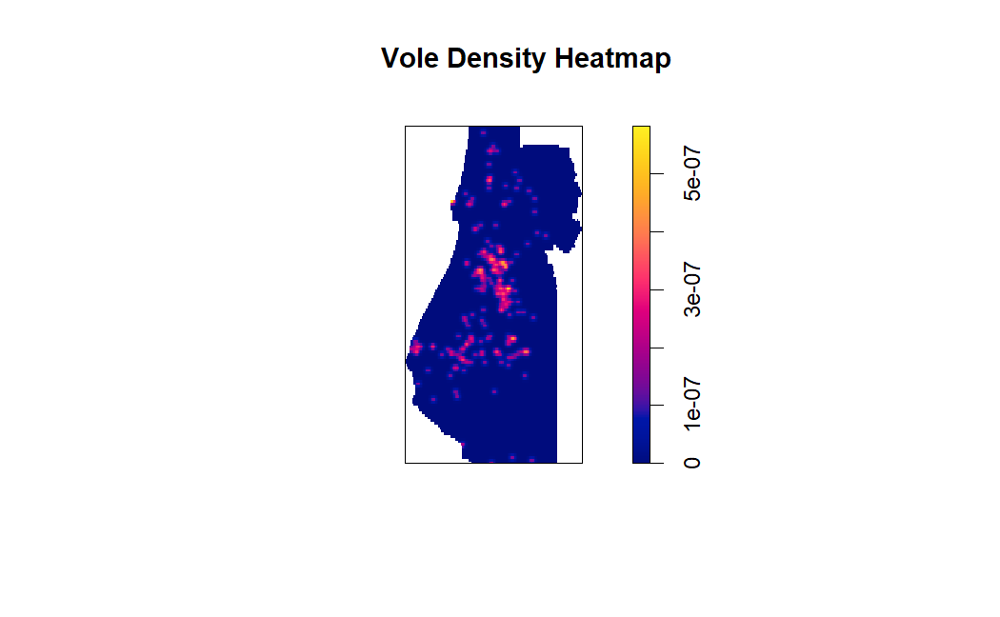
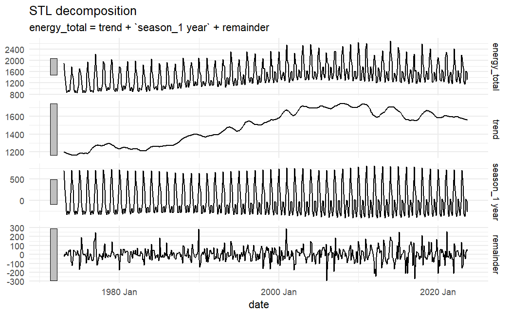

# Lab 8: Point Pattern & Time Series Analyses

This lab was a learning module as part of the ESM 244 course in Advanced Data Analysis Methods.

**What I learned, and the type of analysis I can quickly support:**
- **Language**: R
- **Data Analysis Methods:** Point Patterns ([spatstat](https://cran.r-project.org/web/packages/spatstat/index.html)) & Time Series ([tsibble](https://cran.r-project.org/web/packages/tsibble/index.html), [feasts](https://cran.r-project.org/web/packages/feasts/index.html), & [fable](https://cran.r-project.org/web/packages/fable/index.html))  
- **Other Activities:** Developing density plots (stats), determining distribution method (spatstat), manipulating time data (tsibble), plotting time data (feasts), forecasting time-based predictions (fable).

